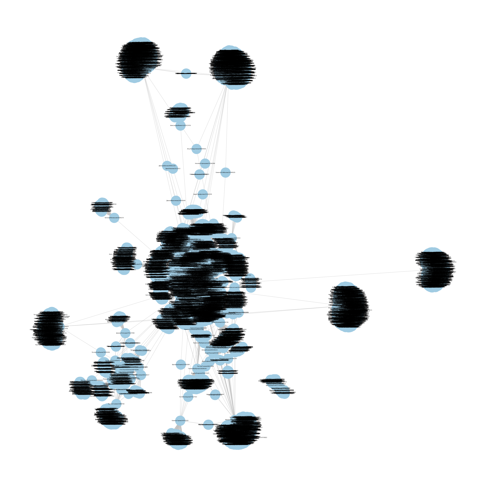

# :star: VK Friends Graph

This script helps you to find the relationship between your friends in VK in form of a graph. 

## :world_map: Usage
In order to use the script you need to open the project in PyCharm(or any other IDE), download neccessary libraries and fill in the following fields: 

```python
if __name__ == "__main__":
    login = 'username' 
    password = 'password' 
    user_id = 0     # your (or any other id) in VK
    depth = 1       # depth 1 will go only one layer in depth (1 -> your friends friends)
```
Once all the fields are filled in, you can start creating the graph by running the script. 
Notice that the more friends you have the more time it will take to complete. Also, **don't try to make the depth greater than 2** because it can lead to 	*temporarily account suspension* meaning that you will not be able to use some of the features of VK.

# :boom: Result
The final result will be stored as a file with .png extension in the root directory of the project and look something like this: 

<p align="center">
   
</p>
